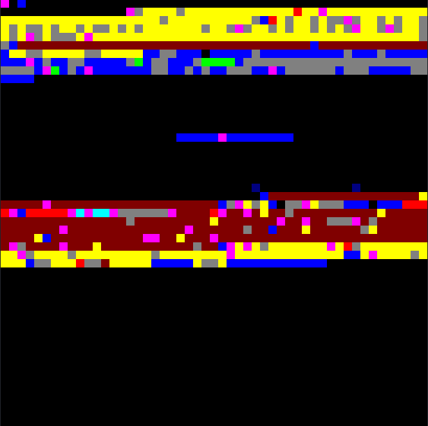

# FragmentClassifier
File fragment classification by deep learning

# Description

The purpose of this tool is to assist in the carving of files in a criminal investigation context.
The aim is to identify the type of each fragment in a given forensic image.

# Usage

## Installation
```shell
pip install -r requirements.txt
```

## How to use

```shell
python fragmentClassifier.py input-file-path output-name
```

## Example
```shell
python fragmentClassifier.py input/8-jpeg-search.dd 8-jpeg-search
```

# Result exemple

## Statistics

| File type | Number of fragments | Total size (KB) |
| --------- | ------------------- | --------------- |
| doc       | 123                 | 503             |
| gz        | 268                 | 1097            |
| html      | 3                   | 12              |
| jpg       | 237                 | 970             |
| pdf       | 14                  | 57              |
| ppt       | 135                 | 552             |
| ps        | 2                   | 8               |
| txt       | 0                   | 0               |
| xls       | 6                   | 24              |
| unknown   | 40                  | 163             |

This table lists the number of each file type found in the fragments of the forensic image.

## Visualisation



This image allows us to see the classification of the fragments with the colours and to see the arrangement of these fragments.

### Color code

Each colour in the image is linked to a file type, here is the correspondence table.

| File type | Color    |
|-----------|----------|
| doc       | blue     |
| gz        | maroon   |
| html      | cyan     |
| jpg       | yellow   |
| pdf       | red      |
| ppt       | gray     |
| ps        | navy     |
| txt       | white    |
| xls       | lime     |
| unknown   | magenta |
| no data   | black    |

# Contributors

- Maxence Lavergne
- Étienne Lécrivain

# License

[MIT](LICENSE) © Maxence Lavergne & Étienne Lécrivain
